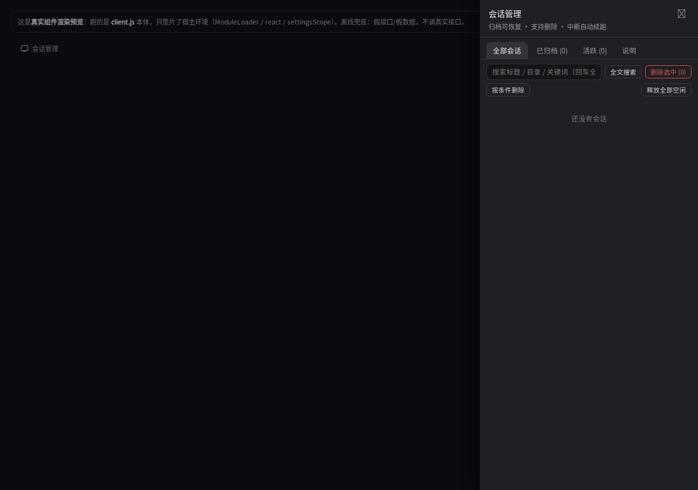
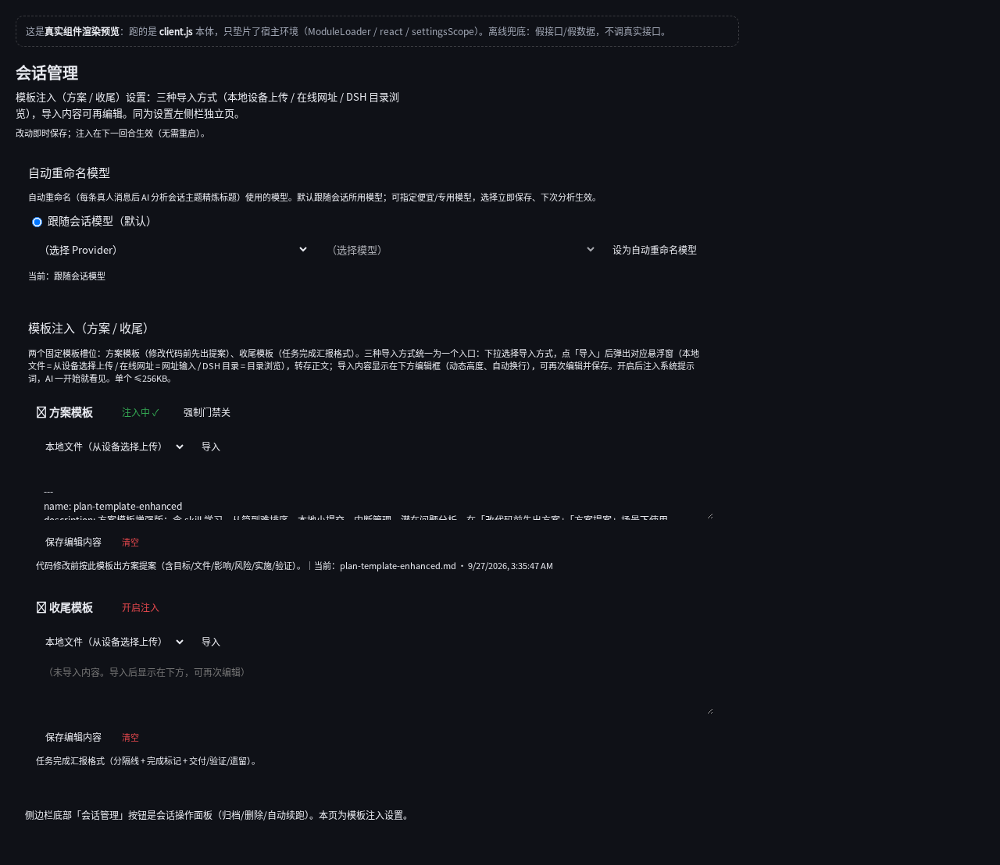

# dsh-session-conductor

> DSH（DeepSeek Harness）会话管理增强插件：让会话列表可管理、可修复、可自动续跑。

侧边栏新增「会话管理」面板，归档会话可恢复、支持批量删除、AI 自动重命名、中断自动续跑、按工作区分组显示；设置页提供方案/收尾模板注入与自动重命名模型选择。

---

## 功能总览

| 功能 | 说明 | 入口 |
|---|---|---|
| 会话管理面板 | 全部/已归档/活跃/说明四视图；归档、恢复、删除（批量/按条件）、置为不活跃、释放全部空闲 | 侧边栏「会话管理」按钮 |
| 自动重命名 | 每个回合后 AI 分析会话内容，主题明显偏离时自动生成新标题（带运行状态后缀） | 面板逐会话开关 |
| 自动续跑 | 识别非人为中断（崩溃/限流/超时/错误），自动继续原任务；失败后 30s 重试 | 面板逐会话开关（临时设置，重启即默认关） |
| 会话分组 | 按工作区分组显示；「在分组下新建会话」 | 设置 → 插件 → 会话分组 |
| 撤回最后一条消息 | 删除最后一条用户消息及整轮回复（先预览 + 二次确认 + .undo-backup 备份） | 面板按钮 |
| 损坏修复 | seq-gap / EIO 坏块 / 双格式（jsonl+zstd 并存）三类会话日志修复 | 面板「说明」页按钮 |
| 价值分析 | LLM 按规则给会话分类（已完成/未完成/久未活跃/活跃中） | 面板按钮 |
| 全文搜索 | 官方 FTS5 优先 + 内置 zstd 扫描兜底 | 面板搜索框 |
| 压缩模型选择 | 上下文自动压缩用模型独立选择（省成本） | 设置 → 插件 → 压缩模型 |
| 模板注入 | 方案模板 / 收尾模板：本地设备上传 / 在线网址 / DSH 目录浏览三种导入，内容可再编辑，注入系统提示词（方案/收尾各一条上下文注入） | 设置 → 会话管理 → 模板注入 |
| 自动重命名模型 | 指定便宜/专用模型做标题分析 | 设置 → 会话管理 |
| 成员模型切换 | 给队友/子代理单独切模型（只动该成员会话，不影响其他成员）：先用 `list_models` 拿确切模型 id，再 `set_member_model` 按成员名/sessionId 切换（写 `model/selection` 事件交给官方投影接管，跨轮持久；未挂载成员也能切，运行中会先等它暂停） | AI 工具 `list_models` / `set_member_model` |
| 上下文用量自查 | AI 按需查自己会话的上下文占用（百分比、已用/容量 tokens）与构成（系统提示词/工具定义/对话消息），占用达 85% 时附收敛建议。数据与界面圆环同源（官方 `contextPressure` / `contextBreakdown` 投影），只读、无参数 | AI 工具 `context_usage` |

## 界面预览

会话管理面板（侧边栏入口）：



设置页 · 模板注入（设置 → 会话管理）：



## 安装（三步曲）

1. **源码进 profile 真实目录**（禁止软链）：
   - `profiles/web/local-plugins/<name>/`
   - `profiles/web/node_modules/<name>/`
2. **profile `package.json` 声明** `"dsh-session-conductor": "file:node_modules/dsh-session-conductor"`，必要时 `dsh.profile.bundles`。
3. **bundle `cordis.patch.yml` 顶层 `- insert:`** 新建 loader 行（`dsh-bundle-patch-must-insert`）。

安装前先 dryrun 模拟（`install-plugin-dryrun-first`），安装后重启 DSH 生效。

## 使用

### 会话管理面板

点击侧边栏底部「会话管理」按钮展开浮层面板：

- **全部**：列出每个会话（标题/目录/时间/状态），支持归档、删除、撤回、自动重命名/续跑开关、搜索、价值分析
- **已归档**：列出被归档的会话，可恢复（取消归档）、删除
- **活跃**：当前活跃（live/running）的会话
- **说明**：损坏修复（seq-gap / EIO / 双格式）+ 使用说明

### 设置页（设置 → 会话管理）

左侧栏「会话管理」独立页：

- **模板注入**：方案模板 / 收尾模板两个槽位。每个槽位下拉选导入方式：
  - **本地文件**：从设备选择上传（系统文件选择器）
  - **在线 md 网址**：输入网址，后端下载转存
  - **DSH 目录浏览**：路径选择悬浮窗（目录树 + 路径输入，点 .md 选中后导入）
  导入内容显示在编辑框（动态高度、自动换行），**可再次编辑并保存**；开启后注入系统提示词，AI 一开始就看见（方案/收尾各一条上下文注入）。
- **自动重命名模型**：选择标题分析用的模型（跟随会话模型或指定便宜/专用模型）

### 真实后端预览页

改 UI 后免重启查看效果：

- **快照模式（推荐，免重启）**：`bash tools/preview-snapshot.sh` → 生成 `assets/preview-*.html`（内嵌生成时真实后端响应），file:// 打开即可查看，无 CORS、无假数据
- **DSH 同源路由**：重启后访问 `/api/session-conductor/preview/settings`（或 `/panel`），同源实时 fetch

## API

插件以 `/api/session-conductor/*` 前缀注册宿主路由：

| 端点 | 方法 | 用途 |
|---|---|---|
| `/list` | GET | 会话列表（标题/目录/时间/状态，落盘缓存按 revision 增量） |
| `/archive` / `/restore` | POST | 归档 / 恢复会话 |
| `/delete` | POST | 删除会话（拒绝运行中） |
| `/undo` | POST | 撤回最后一条消息 |
| `/auto-rename` | POST | 自动重命名开关 |
| `/auto-continue` | POST | 自动续跑开关 |
| `/auto-continue-gate` | GET/POST | 全局续跑闸门 |
| `/release` | POST | 释放空闲会话 |
| `/value-analysis` | POST | 价值分析 |
| `/repair` / `/repair-eio` / `/repair-dual` | POST | 三类损坏修复 |
| `/search` | GET | 全文搜索 |
| `/compaction-model` | GET/POST | 压缩模型 |
| `/templates` | GET/POST | 模板注入（slots 元信息 + 内容） |
| `/templates/dir` | GET | 目录浏览 |
| `/auto-rename-model` | GET | 自动重命名模型（透传官方 modelCatalog） |
| `/i18n` | GET | 语言包（zh/en 外置 JSON） |
| `/preview/settings` `/preview/panel` | GET | 真实后端预览页（同源服务） |

示例：

```bash
curl http://<host>/api/session-conductor/list
# → { "ok": true, "sessions": [ { "id": "...", "title": "...", "cwd": "...", "updatedAt": 172... } ], "total": N }
```

```bash
curl -X POST http://<host>/api/session-conductor/archive \
  -H "Content-Type: application/json" -d '{"id":"<sessionId>"}'
# → { "ok": true, "archived": true }
```

## 文档索引

> 文件目录结构、版本列表、函数列表由 dsh-git-push 的 doc-tree / doc-version / doc-func 工具维护（独立 md，README 只引用）：

- [文件目录结构](docs/FILE-TREE.md) — 目录树与文件作用（doc-tree 维护，`tree-doc.json` 注释映射）
- [版本列表](docs/VERSIONS.md) — 按 git 提交聚合的版本记录表（doc-version 维护）
- [函数列表](docs/FUNCTIONS.md) — lib/ 全部导出函数的名称/位置/签名（doc-func 维护）